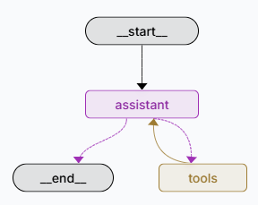

.. _ai_utilities:

AI Utils
========

Text Similarity
---------------

Text similarity is a measure of how alike two pieces of text are in terms of meaning, structure, or content.
Toolium provides several methods to compare and validate text similarity using different AI techniques:

1. `SpaCy <https://spacy.io/>`_: Uses the SpaCy library to compute text similarity with pre-trained NLP models. Fast,
lightweight and good for general-purpose text analysis.

2. `Sentence Transformers <https://github.com/UKPLab/sentence-transformers>`_: Leverages Sentence Transformers for
semantic textual similarity using deep learning embeddings. Best balance of accuracy and performance for semantic
similarity.

3. `OpenAI <https://github.com/openai/openai-python>`_: Utilizes OpenAI's language models for advanced semantic text
comparison. Provides the most sophisticated analysis but requires API access and it may incur costs.

Usage
~~~~~

You can use the function `assert_text_similarity` from `toolium.utils.ai_utils.text_similarity` module to compare
two texts using any of these methods. You can specify the method to use with the `similarity_method` parameter and set a
threshold for similarity with the `threshold` parameter (a value between 0 and 1, where 1 means identical and 0 means
completely different).

.. code-block:: python

    from toolium.utils.ai_utils.text_similarity import assert_text_similarity

    # Basic usage
    input_text = "The quick brown fox jumps over the lazy dog"
    expected_text = "A fast brown fox leaps over a sleepy dog"  # Admits both a single expected text or a list of expected texts
    threshold = 0.8  # Similarity threshold between 0 and 1
    similarity_method = 'spacy'  # Options: 'spacy', 'sentence_transformers', 'openai', 'azure_openai'

    # Validate similarity
    assert_text_similarity(input_text, expected_text, threshold=threshold, similarity_method=similarity_method)

Configuration
~~~~~~~~~~~~~

Default similarity method can be set in the properties.cfg file with the property *text_similarity_method* in
*[AI]* section::

    [AI]
    text_similarity_method: openai  # Options: 'spacy' (default), 'sentence_transformers', 'openai', 'azure_openai'
    spacy_model: en_core_web_lg  # SpaCy model to use, en_core_web_sm by default
    sentence_transformers_model: all-MiniLM-L6-v2  # Sentence Transformers model to use, all-mpnet-base-v2 by default
    openai_model: gpt-3.5-turbo  # OpenAI model to use, gpt-4o-mini by default

To select models for each method, you can refer to the following links:

* `SpaCy models <https://spacy.io/models>`_
* `Sentence Transformers models <https://github.com/UKPLab/sentence-transformers>`_
* `OpenAI models <https://platform.openai.com/docs/models>`_

Installation
~~~~~~~~~~~~

Make sure to install the required libraries for the chosen method. For SpaCy, Sentence Transformers or OpenAI LLM, you
can install them with the following command:

.. code-block:: bash

    pip install toolium[ai]

**Additional Requirements:**

For SpaCy, you also need to download the language model, i.e. for small English model:

.. code-block:: bash

    python -m spacy download en_core_web_sm

For OpenAI LLM, you need to set up your configuration in environment variables, that it may depend on the type of access
you have (direct OpenAI access or Azure OpenAI):

.. code-block:: bash

    # For example, to configure direct OpenAI access:
    OPENAI_API_KEY=<your_api_key>

.. code-block:: bash

    # For example, to configure Azure OpenAI:
    AZURE_OPENAI_API_KEY=<your_api_key>
    AZURE_OPENAI_ENDPOINT=<your_endpoint>
    OPENAI_API_VERSION=<your_api_version>

Text Readability
----------------

Text readability is a measure of how user-friendly and comprehensible a piece of text is.
Toolium currently provides a single method to assess text readability, using the `SpaCy <https://spacy.io/>`_ library.

Usage
~~~~~

You can use the function `assert_text_readability` from `toolium.utils.ai_utils.text_readability` module to assess
the readability of a text. You can set the `readability_method` (currently only `spacy`), the `threshold`
(a value between 0 and 1, where 1 means the text is very readable and 0 means it is not readable at all) and
optionally the `technical_characters`, a list of characters to be considered as non-linguistic content,
if you need to overide the ones set by default.

.. code-block:: python

    from toolium.utils.ai_utils.text_readability import assert_text_readability
    # Basic usage
    input_text = "This is a readable text with proper structure and vocabulary."
    threshold = 0.8  # Readability threshold between 0 and 1
    technical_characters = ['$', '%', '&']  # Optional: list of characters considered non-linguistic content
    readability_method = 'spacy'  # Only 'spacy' is currently supported

    # Validate readability
    assert_text_readability(input_text, threshold=threshold, technical_characters=technical_characters, readability_method=readability_method)

Configuration
~~~~~~~~~~~~~

Default readability method and spacy model can be set in the *[AI]* section of the properties.cfg file::

    [AI]
    text_readability_method: spacy  # Only 'spacy' is currently supported
    spacy_model: en_core_web_md  # SpaCy model to use, en_core_web_md by default

For more information on SpaCy models, you can refer to the following link:

* `SpaCy models <https://spacy.io/models>`_

Installation
~~~~~~~~~~~~

The requirements are the same explained for `SpaCy` in the
`installation section of Text Similarity <https://toolium.readthedocs.io/en/latest/ai_utils.html#installation>`_

Answer Evaluation using LLM-as-a-Judge
--------------------------------------

Answer evaluation using LLM-as-a-Judge is a technique to assess the quality and correctness of an LLM-generated answer
by comparing it against a reference answer using another LLM. This approach provides context-aware evaluation considering
semantic similarity, factual accuracy, completeness, and relevance.

Toolium provides methods to evaluate answers using OpenAI and Azure OpenAI models with optional structured output
using Pydantic models.

Usage
~~~~~

You can use the functions from the `toolium.utils.ai_utils.evaluate_answer` module to evaluate LLM answers:

**Basic evaluation without structured response:**

.. code-block:: python

    from toolium.utils.ai_utils.evaluate_answer import get_answer_evaluation_with_azure_openai

    llm_answer = "Paris is the capital of France and has a population of over 2 million people."
    reference_answer = "The capital of France is Paris."
    question = "What is the capital of France?"

    similarity, response = get_answer_evaluation_with_azure_openai(
        llm_answer=llm_answer,
        reference_answer=reference_answer,
        question=question,
        model_name='gpt-4o'
    )

    print(f"Similarity score: {similarity}")
    print(f"Explanation: {response['explanation']}")

**Evaluation with structured Pydantic response:**

.. code-block:: python

    from pydantic import BaseModel, Field
    from toolium.utils.ai_utils.evaluate_answer import get_answer_evaluation_with_azure_openai

    class SimilarityEvaluation(BaseModel):
        """Model for text similarity evaluation response"""
        similarity: float = Field(description='Similarity score between 0.0 and 1.0', ge=0.0, le=1.0)
        explanation: str = Field(description='Brief justification for the similarity score')

    llm_answer = "Paris is the capital of France and has a population of over 2 million people."
    reference_answer = "The capital of France is Paris."
    question = "What is the capital of France?"

    similarity, response = get_answer_evaluation_with_azure_openai(
        llm_answer=llm_answer,
        reference_answer=reference_answer,
        question=question,
        model_name='gpt-4o',
        response_format=SimilarityEvaluation
    )

    print(f"Similarity score: {similarity}")
    print(f"Explanation: {response.explanation}")

**Advanced evaluation with custom evaluation criteria:**

.. code-block:: python

    from pydantic import BaseModel, Field
    from toolium.utils.ai_utils.evaluate_answer import get_answer_evaluation_with_azure_openai

    class AnswerEvaluation(BaseModel):
        """Comprehensive evaluation model"""
        similarity: float = Field(description='Similarity score between 0.0 and 1.0', ge=0.0, le=1.0)
        explanation: str = Field(description='Detailed evaluation feedback')
        accuracy: float = Field(description='Factual correctness score 1-5')
        completeness: float = Field(description='Information completeness score 1-5')
        relevance: float = Field(description='Relevance to question score 1-5')

    similarity, response = get_answer_evaluation_with_azure_openai(
        llm_answer=llm_answer,
        reference_answer=reference_answer,
        question=question,
        model_name='gpt-4o',
        response_format=AnswerEvaluation
    )

    print(f"Similarity: {similarity}")
    print(f"Accuracy: {response.accuracy}/5")
    print(f"Completeness: {response.completeness}/5")
    print(f"Relevance: {response.relevance}/5")

**Assertion with threshold validation:**

.. code-block:: python

    from toolium.utils.ai_utils.evaluate_answer import assert_answer_evaluation

    # Validate that LLM answer meets minimum similarity threshold
    assert_answer_evaluation(
        llm_answer="Paris is both the capital and the most populous city in France.",
        reference_answers="The capital and largest city of France is Paris.",
        question="What is the capital of France and its largest city?",
        threshold=0.7,  # Minimum similarity score (0.0 to 1.0)
        provider='azure',
        model_name='gpt-4o'
    )

Evaluation Methods
~~~~~~~~~~~~~~~~~~

The module provides the following evaluation methods:

* **assert_answer_evaluation()**: Evaluates answer and asserts if similarity meets threshold
* **get_answer_evaluation_with_openai()**: Uses OpenAI's API directly for evaluation
* **get_answer_evaluation_with_azure_openai()**: Uses Azure OpenAI's API for evaluation

Evaluation Criteria
~~~~~~~~~~~~~~~~~~~

When evaluating answers, the LLM considers the following criteria:

- **Semantic similarity**: Does the LLM answer convey the same meaning as the reference answer, even if phrased differently?
- **Factual accuracy**: How factually correct is it compared to the reference answer?
- **Completeness**: How thoroughly does it address all aspects of the question, covering all information from the reference answer?
- **Relevance**: How well does it directly answer the specific question asked?

Scoring Guide
~~~~~~~~~~~~~

- **1.0**: Perfect semantic match - answer is equivalent to reference answer
- **0.7-0.9**: Similar meaning - minor differences that don't affect overall correctness
- **0.4-0.6**: Incomplete or partially similar - major differences or missing information
- **0.0-0.3**: Different, irrelevant or contradictory - does not match the reference answer

Configuration
~~~~~~~~~~~~~

Default OpenAI model can be set in the properties.cfg file in the *[AI]* section::

    [AI]
    provider: azure  # AI provider to use, openai by default
    openai_model: gpt-4o  # OpenAI model to use, gpt-4o-mini by default

Installation
~~~~~~~~~~~~

Make sure to install the required libraries:

.. code-block:: bash

    pip install toolium[ai]

For Azure OpenAI, you need to set up your configuration in environment variables:

.. code-block:: bash

    AZURE_OPENAI_API_KEY=<your_api_key>
    AZURE_OPENAI_ENDPOINT=<your_endpoint>
    OPENAI_API_VERSION=<your_api_version>

For standard OpenAI:

.. code-block:: bash

    OPENAI_API_KEY=<your_api_key>

.. _accuracy_tags_for_behave_scenarios:

Accuracy tags for Behave scenarios
----------------------------------

@accuracy
~~~~~~~~~

You can use accuracy tags in your Behave scenarios to specify the desired accuracy level and number of executions for
scenarios that involve AI-generated content. The accuracy tag follows the format `@accuracy_<percent>_<executions>`,
where `<percent>` is the desired accuracy percentage (0-100) and `<executions>` is the number of executions to achieve
that accuracy. For example, `@accuracy_80_10` indicates that the scenario must be executed 10 times and it should
achieve at least 80% accuracy.

.. code-block:: bash

    @accuracy_80_10
    Scenario: Validate AI-generated response accuracy
      Given the AI model generates a response
       When the user sends a message
       Then the AI response should be accurate

When a scenario is tagged with an accuracy tag, Toolium will automatically execute the scenario multiple times. If the
scenario does not meet the specified accuracy after the given number of executions, it will be marked as failed.

Other examples of accuracy tags:
- `@accuracy_percent_85_executions_10`: 85% accuracy, 10 executions
- `@accuracy_percent_75`: 75% accuracy, default 10 executions
- `@accuracy_90_5`: 90% accuracy, 5 executions
- `@accuracy_80`: 80% accuracy, default 10 executions
- `@accuracy`: default 90% accuracy, 10 executions

A csv report with the results of each execution will be generated in the `accuracy` folder inside the output folder.

@accuracy_data
~~~~~~~~~~~~~~

You can also use accuracy data tags in your Behave scenarios to specify different sets of accuracy data for each
execution. The accuracy data tag follows the format `@accuracy_data_<suffix>`, where `<suffix>` is a custom suffix to
identify the accuracy data set. For example, `@accuracy_data_greetings` indicates that the scenario should use the
accuracy data set with the suffix "greetings".

.. code-block:: bash

    @accuracy_80
    @accuracy_data_greetings
    Scenario: Validate AI-generated greeting responses
      Given the AI model generates a greeting response
       When the user sends "[CONTEXT:accuracy_execution_data.question]" message
       Then the AI greeting response should be similar to "[CONTEXT:accuracy_execution_data.answer]"

When a scenario is tagged with an accuracy data tag, Toolium will automatically use the specified accuracy data set for
each execution. This allows you to test different scenarios with varying data inputs. Accuracy data should be stored
previously in the context storage under the key `accuracy_data_<suffix>`, where `<suffix>` matches the one used in the
tag. For example, for the tag `@accuracy_data_greetings`, the accuracy data should be stored under the key
`accuracy_data_greetings`. The accuracy data should be a list of dictionaries, where each dictionary contains the data
for a specific execution.

For example, to store accuracy data for greetings, you can do the following in a step definition:

.. code-block:: python

    accuracy_data_greetings = [
        {"question": "Hello", "answer": "Hi, how can I help you?"},
        {"question": "Good morning", "answer": "Good morning! What can I do for you today?"},
        {"question": "Hey there", "answer": "Hey! How can I assist you?"}
    ]
    context.storage["accuracy_data_greetings"] = accuracy_data_greetings

This way, during each execution of the scenario, Toolium will use the corresponding data from the accuracy data set
based on the execution index.

after_accuracy_scenario method
~~~~~~~~~~~~~~~~~~~~~~~~~~~~~~

You can monkey-patch the `after_accuracy_scenario` method in `toolium.utils.ai_utils.accuracy` module to implement
custom behavior after accuracy scenario execution, like calling Allure `after_scenario` method.

.. code-block:: python

    from toolium.utils.ai_utils import accuracy

    def custom_after_accuracy_scenario(context, scenario):
        context.allure.after_scenario(context, scenario)

    # Monkey-patch the hook
    accuracy.after_accuracy_scenario = custom_after_accuracy_scenario

AI agents for testing
---------------------

Toolium provides utilities to create and execute AI agents in your tests using langgraph library, allowing you to
simulate complex user interactions or validate AI-generated responses.

You can create an AI agent using the `create_react_agent` function from the `toolium.utils.ai_utils.ai_agent` module.
This function allows you to create a ReAct agent, which is a type of AI agent that can reason and act based on the
conversation history and tool interactions. You must specify the system message with AI testing agent instructions
and the tool method, that the agent can use to send requests to the system under test and receive responses.

Once you have created an AI agent, you can execute it using the `execute_agent` function from the same module. This
function will run the agent and log all conversation messages and tool calls, providing insights into the agent's
behavior and the interactions it had during execution.
You can also provide previous messages to the agent to give it context for its reasoning and actions.

.. code-block:: python

    from toolium.utils.ai_utils.ai_agent import create_react_agent, execute_agent

    # Create a ReAct agent with a system message and a tool method
    system_message = "You are an assistant that helps users find TV content based on their preferences."
    tool_method = tv_recommendations  # This should be a function that the agent can call as a tool
    provider = 'azure'  # Specify the AI provider to use, e.g., 'azure' or 'openai'
    model_name = 'gpt-4o-mini'  # Specify the model to use for the agent

    agent = create_react_agent(system_message, tool_method=tool_method, provider=provider, model_name=model_name)

    # Execute the agent and log all interactions
    final_state = execute_agent(agent)

Default provider and model can be set in the properties.cfg file in *[AI]* section::

    [AI]
    provider: azure  # AI provider to use, openai by default
    openai_model: gpt-3.5-turbo  # OpenAI model to use, gpt-4o-mini by default

