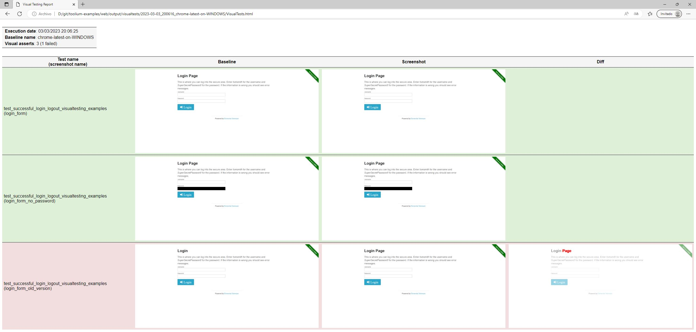

.. _visual_testing:

Visual Testing
==============

How does visual testing work?
-----------------------------

Visual Testing in Toolium is a tool for checking automatically if your web pages or mobile apps are rendered as
expected. Tests are executed the same way, both on Selenium and Appium.

To achieve this goal, this tool follows these steps:

- It takes a screenshot of the current web page or mobile screen (a full screenshot or a single element).
- Then, if exists a previous capture with the same name, it compares both of them and shows their differences.
- If not, it saves the screenshot to be used as a base in later executions. Probably these images might be reviewed
  manually to assure that can be used as expected result.

As web pages and mobile applications look different when using different browsers, mobile devices, resolutions, etc.
Toolium provides you with a way of storing different base images, called baselines, through a configuration property
called *baseline_name*.

The libraries used to make the comparisons of the images are `Needle <https://github.com/bfirsh/needle>`_, another
python tool for visual testing with Selenium, and `Pillow <https://github.com/python-pillow/Pillow>`_, the basic
python library for image management.

After every execution, the tool generates a HTML report with the screenshots and the resulting comparisons. The
following figure shows an example of this report. As can be seen, there's a row per assert in your tests, with its
background in green or red, depending on the comparison.

How to execute it?
------------------

Visual asserts could be used in different ways:

* Comparing a full page screenshot with the expected result: a previously captured image with the same *screenshot_name*

.. code-block:: python

    self.assert_full_screenshot(screenshot_name)

* Comparing a single element, represented by a `PageElement <http://toolium.readthedocs.org/en/latest/toolium.pageelements.html#module-toolium.pageelements.page_element>`_

.. code-block:: python

    form_page_element = PageElement(By.XPATH, '//form')
    self.assert_screenshot(form_page_element, screenshot_name)

or

.. code-block:: python

    form_page_element = PageElement(By.XPATH, '//form')
    form_page_element.assert_screenshot(screenshot_name)

* Comparing a single element, represented by a *WebElement*

.. code-block:: python

    form_element = self.driver.find_element_by_xpath('//form')
    self.assert_screenshot(form_element, screenshot_name)

* Comparing a single element, represented by its locator

.. code-block:: python

    form_element_locator = (By.XPATH, '//form')
    self.assert_screenshot(form_element_locator, screenshot_name)

* Moreover, elements can be excluded from full or element comparisons. The elements to be excluded can also be identified by a *PageElement*, a *WebElement* or a locator.

.. code-block:: python

    page_element_1 = PageElement(By.ID, 'first_id')
    page_element_2 = PageElement(By.ID, 'second_id')
    self.assert_full_screenshot(screenshot_name, exclude_elements=[page_element_1, page_element_2])

* Both comparing methods have an optional parameter called *threshold* that marks the percentage of pixels that are allowed to be different. It must be a number between 0 and 1.

.. code-block:: python

    self.assert_full_screenshot(screenshot_name, threshold=0.1)

* They have other optional parameter called *force* that forces to compare the screenshot even if visual testing is disabled by configuration. If the assertion fails, the test fails.

.. code-block:: python

    self.assert_full_screenshot(screenshot_name, force=True)

How to configure it?
--------------------

Toolium properties related to Visual Testing are stored in properties.cfg ::

    [VisualTests]
    enabled: true
    fail: false
    save: false
    complete_report: true
    baseline_name: {Driver_type}
    engine: pil

enabled
~~~~~~~
| *true*: visual testing is enabled, screenshots are captured and compared
| *false*: visual testing is disabled, no screenshots are captured

fail
~~~~
| *true*: if a visual assertion fails, the test fails
| *false*: although a visual assertion fails, the test passes

save
~~~~
| *true*: baseline images will be overwritten with new screenshots
| *false*: screenshots will be compared with already saved baseline images

complete_report
~~~~~~~~~~~~~~~
| *true*: html report will contain failed and passed visual assertions
| *false*: html report will only contain failed visual assertions

baseline_name
~~~~~~~~~~~~~
| It contains the name of the images base to compare current execution screenshots with, and it might depends on the browser, the mobile device or resolution used in the execution.
| The easiest way of generating a custom name per environment is to use the values of other configuration properties. To access a property value use the following format: {SectionName_optionName}.
| Some examples of baseline_name values are:

- *{Driver_type}*: depending on the value of *type* property, baseline_name might take one of these values: firefox, iexplore, chrome... This is the value by default.
- *{Driver_type}-{Capabilities_version}-{Capabilities_platform}*: baseline_name might take one of these values: iexplore-11-WIN8, safari-9.0-YOSEMITE...
- *{AppiumCapabilities_deviceName}-{AppiumCapabilities_platformVersion}*: baseline_name might take one of these values: iPhone_6-8.3, iPhone_6-9.1, iPhone_6s-9.1...
- *{PlatformVersion}*: baseline_name will take the value of the mobile platform version, instead of the platformVersion configuration property
- *{Version}*: baseline_name will take the value of version capability, although it is not configured
- *{RemoteNode}*: baseline_name will take the value of the remote node name

engine
~~~~~~
| Needle can compare images using different libraries (or engines) underneath. Currently, it supports Pillow, PerceptualDiff and ImageMagick.

- *pil*: uses Pillow to compare images. It's the default option and it's installed as a Toolium dependency.
- *perceptualdiff*:  uses `PerceptualDiff <http://pdiff.sourceforge.net>`_ to compare images. It is a faster library and besides generates a diff image, highlighting the differences between the baseline image and the new screenshot. It requires to be installed separately and depends on your host.
- *imagemagick*:  uses `ImageMagick <http://www.imagemagick.org>`_ to compare images. It also generates a diff image, highlighting the differences in a more visual way than perceptualdiff. It requires to be installed separately and depends on your host.
